## NuBuzz

# iter 2
In the second iteration we have had the following progress

    Aditya
    1)Added the functionality to create posts 
    2)Added the functionality to like/unlike and increment the likes on a comment

    Bhoomika
    1)Added the edit form for the user profile that allows users to upload their profile picture and details like name, username, phone number, etc.
    2)Added a card on the home page feed to enable users to create a post.
    3)Added the comment functionality to a post and styling to it.

    Nikitha
    1)Added the follow/unfollow feature
    4)Added carousel for posts on home page
    5)Added post edit functionality
    6)Added like/unlike feature to each post

The following are the screenshots of the above mentioned features - 

Create a Post

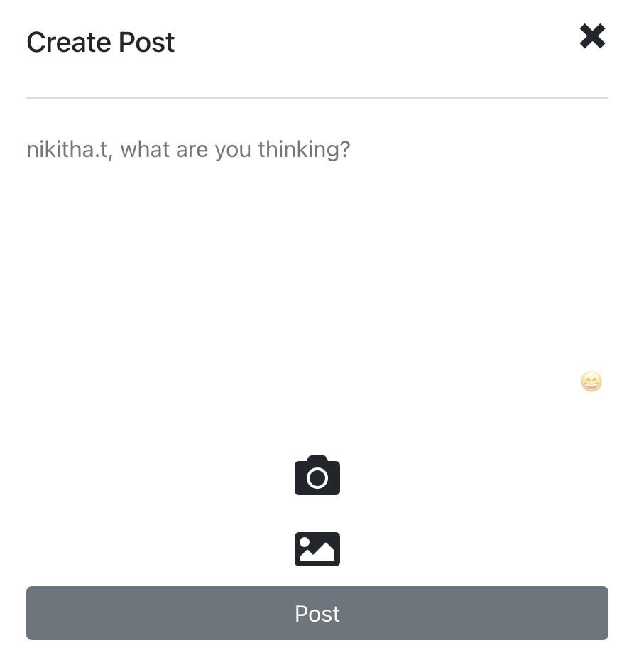

Edit a user profile

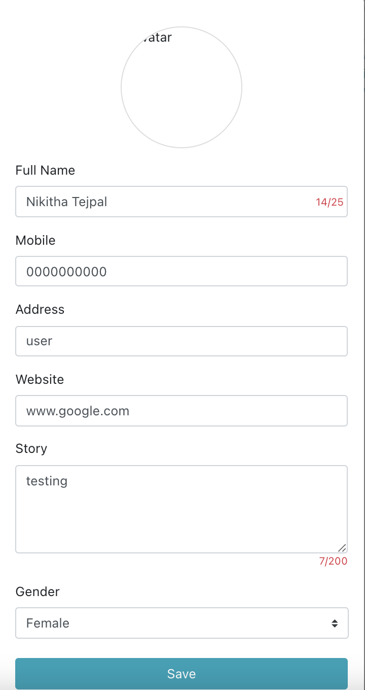

Follow/UnFollow

Hit a like button 

Post a comment 
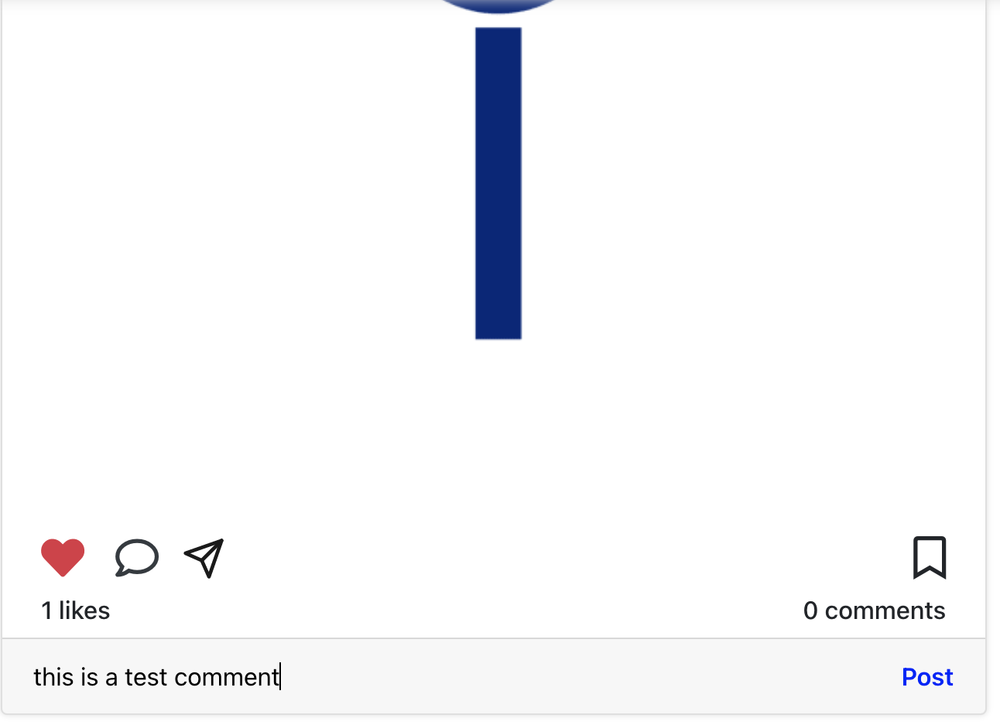

Update a post with caption media
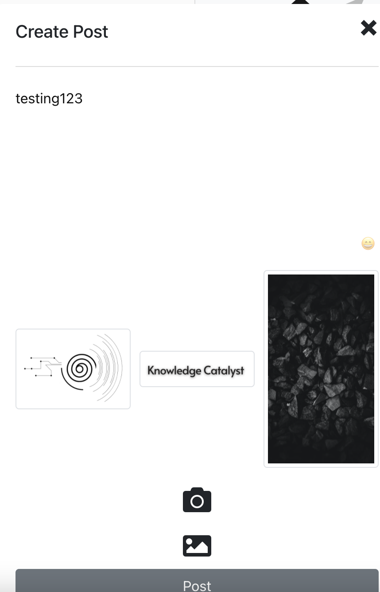

View a post Home Page
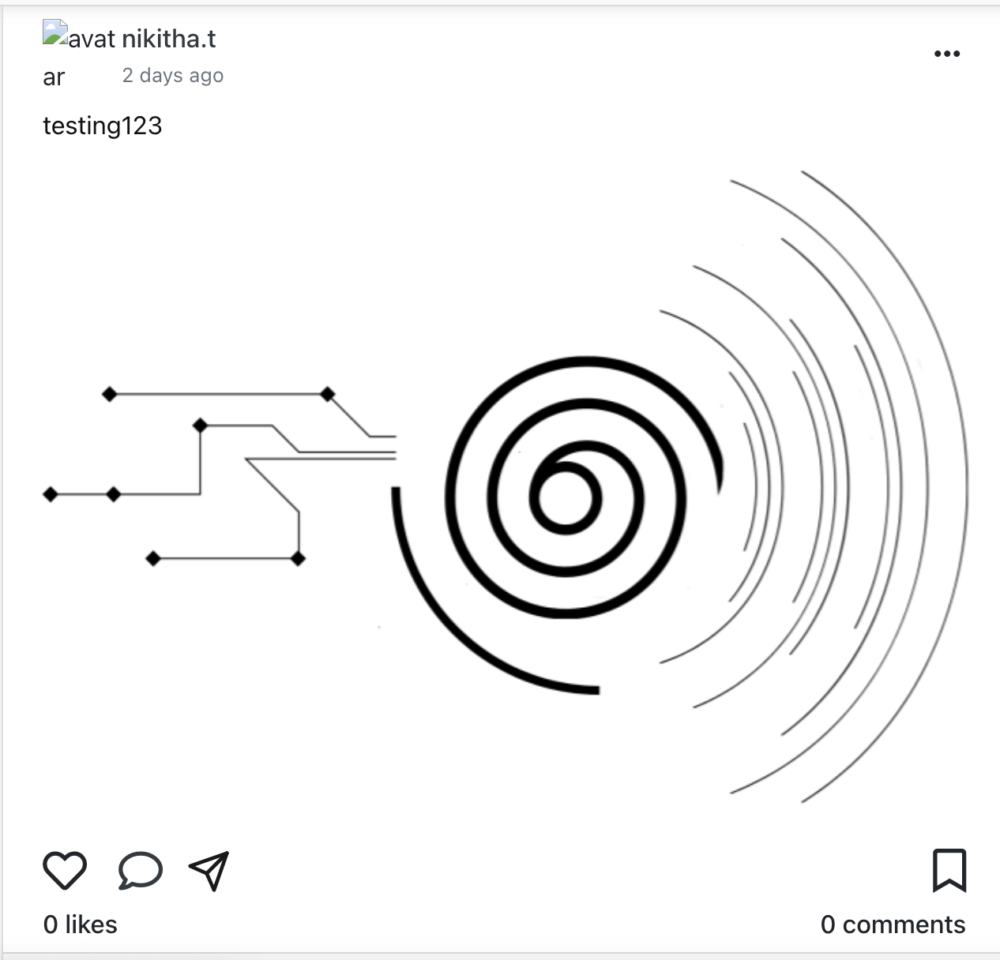

# iter 1
Is a social media web application project which allows the user to register an account, once the account is registered  there is an entry created in the database for the particular user. Now once a user registers and creates and account they are able to to follow friends and pages of their choice, like, comment and share pictures, message people. This application is being developed as part of the coursework for CS5610. This project is a collective effort among  three students- Adithya Chandrashekar, Bhoomika Madhukar and Nikitha Tejpal. 

We have used Mongoose database and established a connection to Mongo DB atlas. Using React and Redux we are developing the various other functionalities of this application. 

For the first iteration we worked on the registration, login, logout, authentication feature of this application. Bhoomika was responsible for the router and authentication section, she was assisted by Nikitha when there were some issues encountered in the authentication feature development. Nikitha worked on the registration and development of the UI of the application so far. Adithya was reponsible for the login and logout features and was assisted by both Bhoomika and Nikitha when there were issues related to these two features. 

Some of the screenshots showing the various features of the application so far: 

The below image shows the Registration page UI
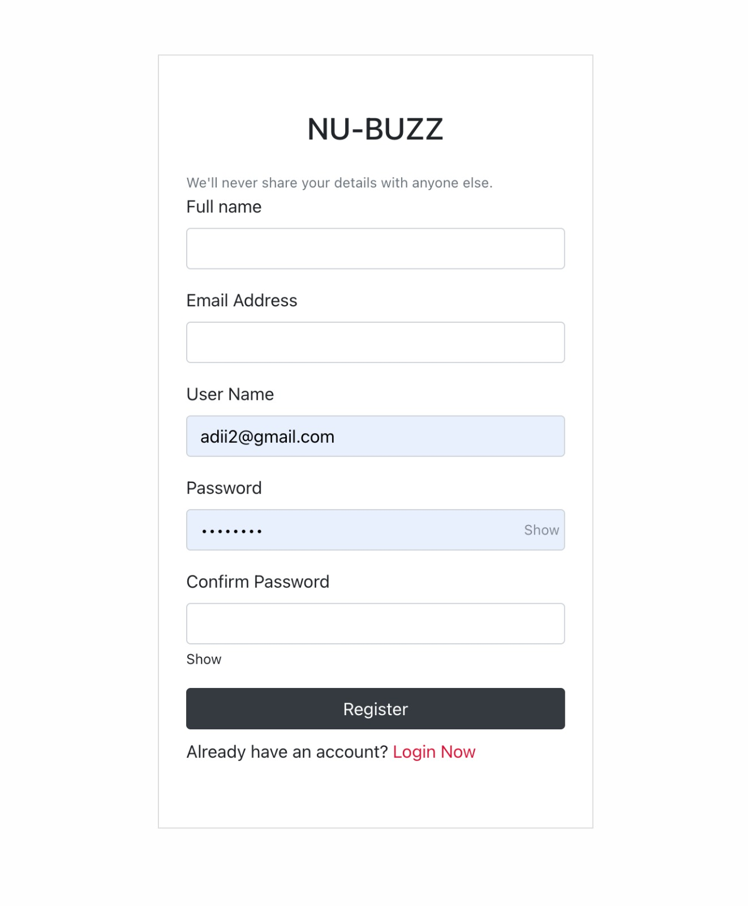

The search bar displays the results of the key to be searched.
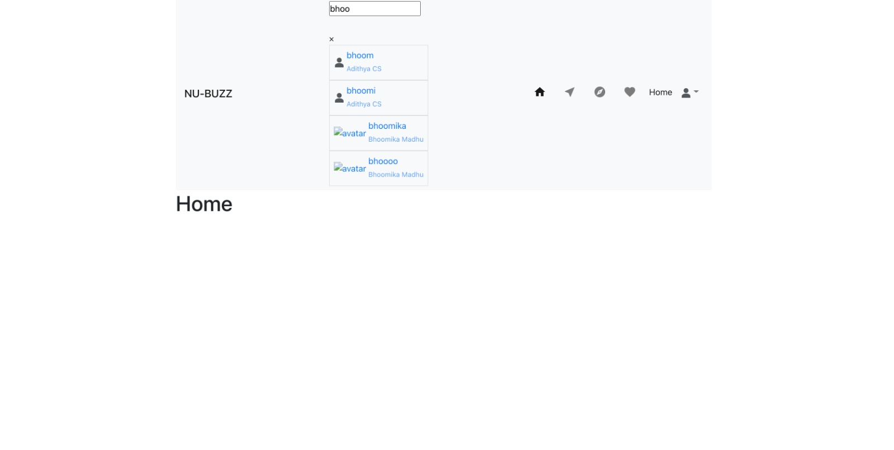
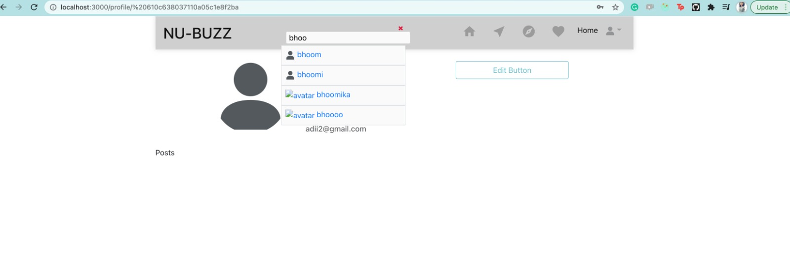

The below image is the profile page os the user
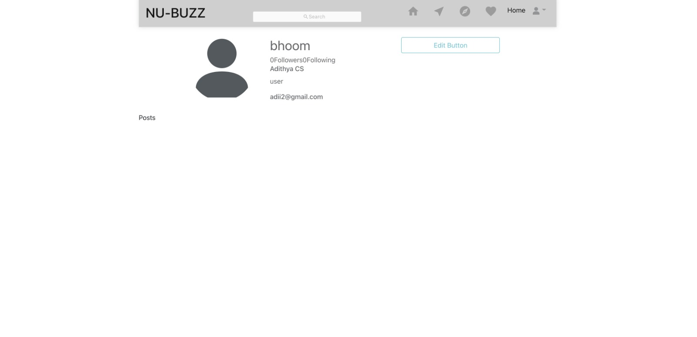

The image below is the Login UI
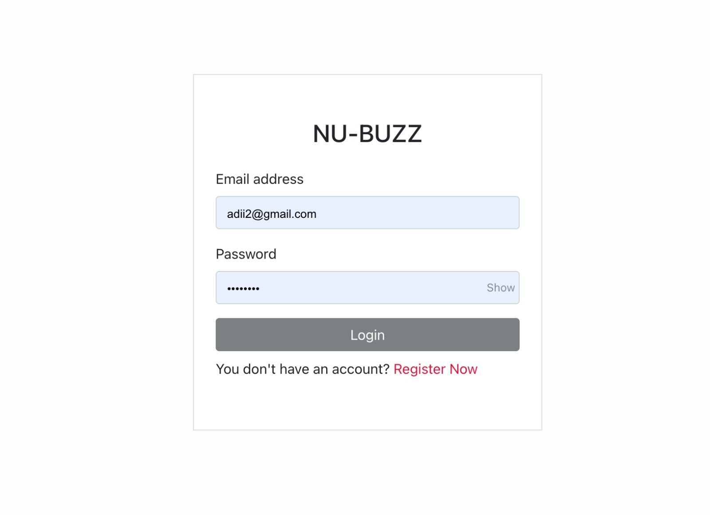

The home page where the user is shown the posts of the users they follow.
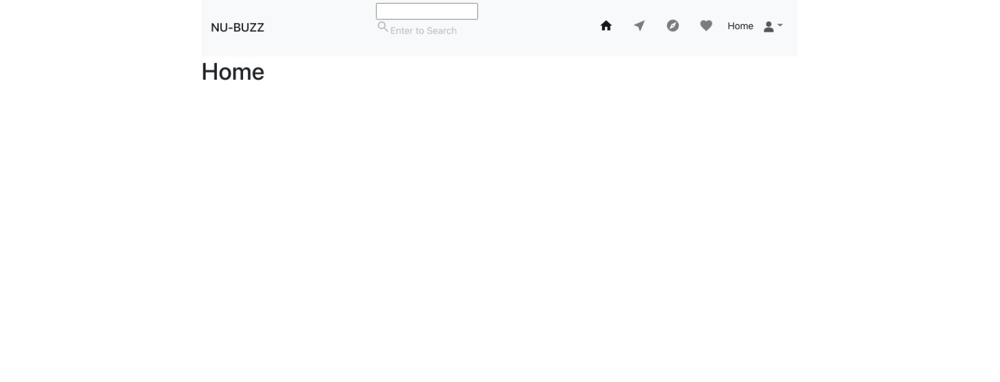

In the next Iteration we are working on adding messaging, adding followers and pictures, updating the like and comment feature of the application and working on the overall aesthetics of the application. 